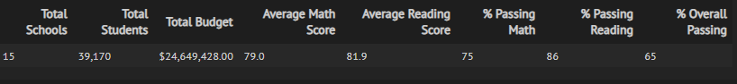
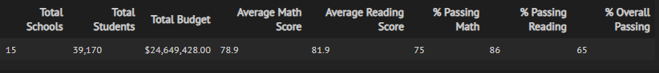
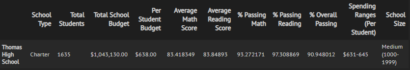
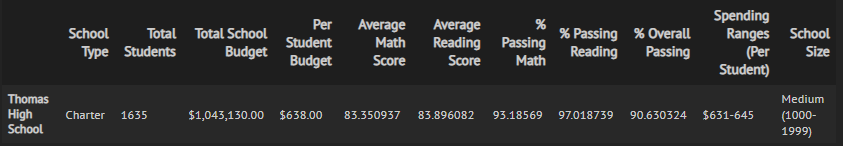
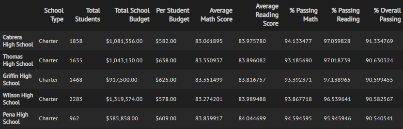
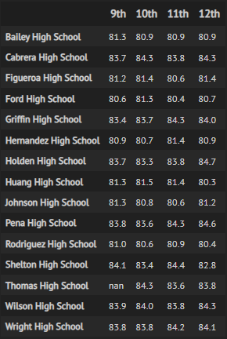

# School District Analysis

## Overview
The school board requested analysis of data for the district's 15 high schools, including school type, size and budget, as well as math and reading
scores for all high school students. Among other things, district leaders wished to see how school performance (as measured by these scores) varied based on
type of school (charter or district), approximate size and per-student budget. 

After completion of our [analysis](PyCitySchools_Challenge.ipynb), district leaders discovered irregularities in test scores for ninth graders at Thomas High 
School. Pending resolution of these issues, we removed the scores in question from our analysis of average math and reading scores. However, we kept the THS ninth 
graders in the analysis for purposes of calculating school sizes and per-student budgets.

## Results

- The removal of the THS ninth graders' scores has little noticeable impact on the school district summary. 
- This adjustment brings down the district's average math score to 78.9% from 79.0%. 
- There is no noticeable impact on reading scores or passing percentages.

[Before](PyCitySchools.ipynb):

After: 

- The impact becomes more visible when looking at THS-specific figures, as we see average math scores and passing percentages fall when excluding the 
questionable ninth-grade scores. 
- However, in the updated analysis, THS' average reading score ticked up a few basis points.

Before:

After:

- Thomas High School remains the second highest performing school even after removal of its ninth graders' scores.

- The adjusted analysis makes grade-level analysis more challenging, as data is missing for the entire ninth grade at THS.
- The other schools' data and data for other grades at THS are unaffected.

## Summary

Adjustment of school data to remove THS' ninth graders' scores brought down the district's average math score very slightly. The updated analysis 
showed lower math scores and passing percentages for THS, but slightly higher reading scores. There was no noticeable impact on scores by school spending, 
size or type.

For future reports, analysts should consider another method of calculating average test scores by spending range, school size and school type. This analysis 
calculated averages of per-school averages. This could mislead stakeholders by assigning equal weight to each school's average scores, regardless of how many 
students' scores were included in the average for each school. It would be better to assign a spending range category to each row of student data in the 
complete school data dataframe (school_data_complete_df), and then calculate the average of scores within each spending range bin.
